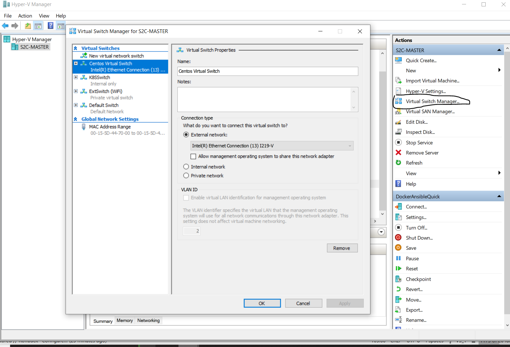

# Atomika Wormhole

```
      Enter the wormhole into Atomika Kubernetes
                       ______
                      /\     \
                     /  \     \
                    /    \_____\
                   _\    / ____/_
                  /\ \  / /\     \
                 /  \ \/_/  \     \
                /    \__/    \_____\
               _\    /  \    / ____/_
              /\ \  /    \  / /\     \
             /  \ \/_____/\/_/  \     \
            /    \_____\    /    \_____\
           _\    /     /    \    / ____/_
          /\ \  /     /      \  / /\     \
         /  \ \/_____/        \/_/  \     \
        /    \_____\            /    \_____\
       _\    /     /            \    / ____/_
      /\ \  /     /              \  / /\     \
     /  \ \/_____/                \/_/  \     \ -axiac
    /    \_____\                    /    \_____\
    \    /     /_  ______  ______  _\____/ ____/_
  /\ \  /     /  \/\     \/\     \/\     \/\     \
 /  \ \/_____/    \ \     \ \     \ \     \ \     \
/    \_____\ \_____\ \_____\ \_____\ \_____\ \_____\
\    /     / /     / /     / /     / /     / /     /
 \  /     / /     / /     / /     / /     / /     /
  \/_____/\/_____/\/_____/\/_____/\/_____/\/_____/
 MIT License, Copyright (c) 2024 S2C Consulting (PtyLtd ZA)
```

Atomika wormhole automates the preparation of machines for use as Kubernetes or Ansible Control nodes. The primary 
vehicle are ISO images of Ubuntu 22 that 
* boots up without user input;
* is minimalistic and
* is pre-installed with Ansible.

There are two images:
* The bare image augments normal Ubuntu22 server with Git and Ansible
* The Atomika image build on bare by preparing itself to run as a Kubernetes node cluster during first boot. See the 
k8s_init.yml Ansible playboork of the [Atomika](https://github.com/jrb-s2c-github/atomika) project for more details on this. 
As such its versioning follows that of [jrb-s2c-github/atomika](https://github.com/jrb-s2c-github/atomika).

The images are opinionated in that it boots:
* Ubuntu Server minimal (No GUI and extended packages);
* UTC;
* US English keyboard;
* en_US.UTF-8 locale;
* one partition hard drive filled to maximum;
* one sudo user called ansible with *unsecured (change this should hardening be required)* public/private key available at 
GitHub root;
* sudo pwd for ansible user of 'atmin' (*change this should hardening be required)* 
* hostname of wormhole and
* Git and Ansible
* does not allow password authentication over SSH

#### It is intended for local development and not for production use without custom hardening

## Dzone.com articles on Atomika Wormhole
- [Ansible and the Pre-Container Arts](https://dzone.com/articles/ansible-and-the-pre-container-arts)

## Windows
A PowerShell script is provided that boots instances directly on the Windows Virtual Machines Hypervizor (Hyper-V). This 
script, furthermore, drops one into a ssh shell on the new virtual machine without further human interaction. However, it 
requires [OpenSSH](https://learn.microsoft.com/en-us/windows-server/administration/openssh/openssh_overview) to be installed.

See links to documentation on Hyper-V lower down.

### Howto create new Virtual Machine
* Register the ansible private key located next to ansible.pub in root with security agent (ssh-agent on my machines)
* Git clone atomika_wormhole.  
* Download the required image from [here](https://drive.google.com/drive/folders/1OY1rDy6MwYi0iXD159igjnJ7IOrBbJ1U)
into /startup_scripts. ISO versions follow that of the versions of Atomika they are prepared for.
* Run '*/startup_scripts/liftoff.ps1 $vm_name $patt_to_image_to_boot*' from a PowerShell prompt with administration privileges. 
The location of the wormhome image can be completed using tabbing.
* Enter a name for the virtual machine that will be created when prompted - Only when it have not been provided as $vm_name above
* Enter the location of the wormhole image to boot - Only when it have not been provided as $patt_to_image_to_boot above
* Wait to be dropped into a SSH shell on the VM.

### Howto reconnect or restart existing Virtual Machine
Run /startup_scripts/startReconnect.ps1 in a PowerShell prompt with admin privileges. Since IP addresses might change 
after restarts, expect the prompt requesting trust to be established to appear again.

#### Troubleshooting
First of all check that the virtual machine is running by connecting to it directly from the Hyper-V manager application.

Should it be running, but the SSH prompt did not appear:
* Confirm that [OpenSSH]((https://learn.microsoft.com/en-us/windows-server/administration/openssh/openssh_overview)) is 
installed. One can also get a shell by connecting from the Hyper-V manager application directly.
* Check that you loaded the private key of the ansible user

### Tips and Tricks
* do not be scared to change the creation parameters in liftoff.sh: amount of processors (-ProcessorCount 8), ram (-MemoryStartupBytes 4GB) 
and virtual hard disk (-NewVHDSizeBytes 40GB), one can always revert back to the original in GitHub
* Mess around in the settings/functionalities of Hyper-V manager. Google and be brave!
* It is possible to change to create a Switch that uses a netword adaptor dedicated to HyperV and change over to it from
the default switch in Hyper-V

### Hyper-V Documentation
* [Install Hyper-V on Windows 10](https://learn.microsoft.com/en-us/virtualization/hyper-v-on-windows/quick-start/enable-hyper-v)
* [Start Hyper-V Manager and create a VM manually](https://learn.microsoft.com/en-us/virtualization/hyper-v-on-windows/quick-start/create-virtual-machine)
* [How to Install and Configure Hyper-V](https://www.dummies.com/article/technology/computers/macs/general-macs/how-to-install-and-configure-hyper-v-264394/)
* [A Practical Guide to Hyper-V Virtual Switch Configuration](https://getlabsdone.com/how-to-configure-hyper-v-virtual-switches/)
* [Configure VM memory in Hyper-V](https://www.bdrsuite.com/blog/configure-dynamic-memory-in-hyper-v-with-best-practices/)
* [Hyper-V Virtual CPUs Explained](https://www.altaro.com/hyper-v/hyper-v-virtual-cpus-explained/)
* My settings to dedicate a network adaptor for use by VM's:


## Outstanding
* Test that HyperV is present and active on Windows 10&11 with Default Switch 
* Script to install OpenSSH
* Tune size of Windows VM hard drive 
* Switch on compression of iso images?
* Provide hash to compare iso against?
* Report failure in PowerShell scripts when not enough ram available
* Test for existence of VM before doing startReconnect.sh
